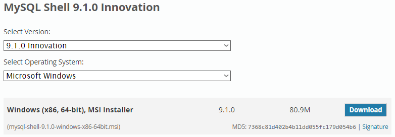
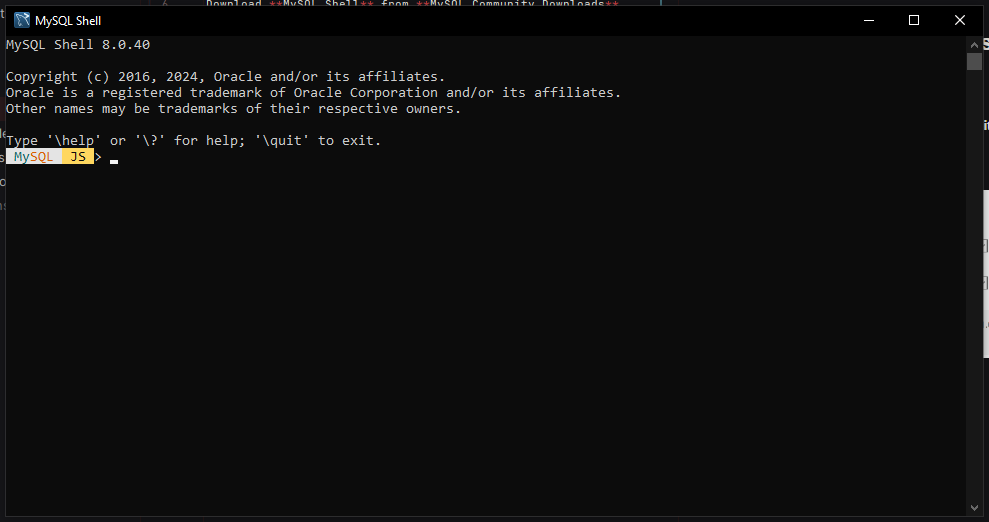
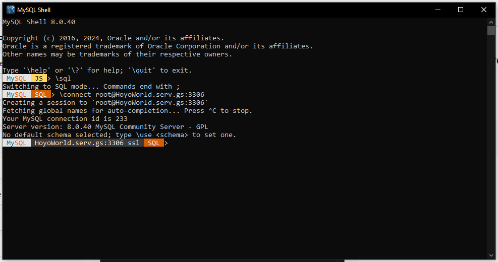

# Installation MySQL Database
## MySQL Shell (Direct Console)

### Required Installation:

Download **MySQL Shell** from **MySQL Community Downloads**

**_Link:_** https://dev.mysql.com/downloads/shell/

### Open MySQL Shell:

**The Following Commands Are:**

Type `\sql` to set the Language to MySQL

Type `\connect <user>@<ip-address>:<port>` to connect MySQL Server

**Current Available MySQL Database Information**

IP ADDRESS: `HoyoWorld.serv.gs`

PORT: `3306`

USER: `root`

PASS: `aaa12345`

**If Successfully Connected it will show this**

## MySQL Database (IntelliJ IDEA)

Open `Database` and Add MySQL Database in `Data Source`

Put the Database Information on the following:

`Host: HoyoWorld.serv.gs`
`Port: 3306`
`User: root`
`Password: aaa12345`

Click `Test Connection` if everything run, Click `Apply` and `OK`

--------------------------------------------------------------------------------------------------------------------------

Hello team.

I made the basic shit (Games, User) without the transaction parts (Wallet, Receipt, and Transaction classes).

I will make it after exams.

I also made the sql tho there is no database connection yet.

FML it's 23:46 || 13/11/2024

--> chico

--------------------------------------------------------------------------------------------------------------------------

\connect root@HoyoWorld.serv.gs:3306